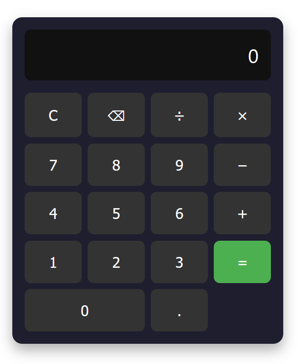

# Angular Hesap Makinesi

Bu proje, Angular kullanarak geliştirilmiş basit bir hesap makinesidir.  
Toplama, çıkarma, çarpma ve bölme işlemleri yapabilir.  
Ayrıca yapılan son 5 işlem bir serviste saklanır ve sayılar özel pipe ile iki basamaklı gösterilir.

---

## Kullanılan Teknolojiler

- Angular (v16+)
- TypeScript
- SCSS (responsive destekli)
- RxJS (temel düzeyde)

---

## Görseller



---

## Kurulum ve Çalıştırma

1. Bu repoyu klonlayın:
   ```bash
   git clone https://github.com/selen21/hesapmakinesi.git
   cd hesapmakinesi
